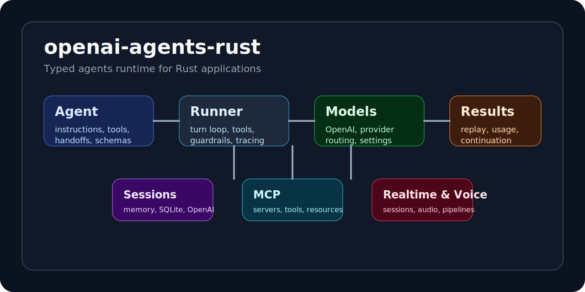
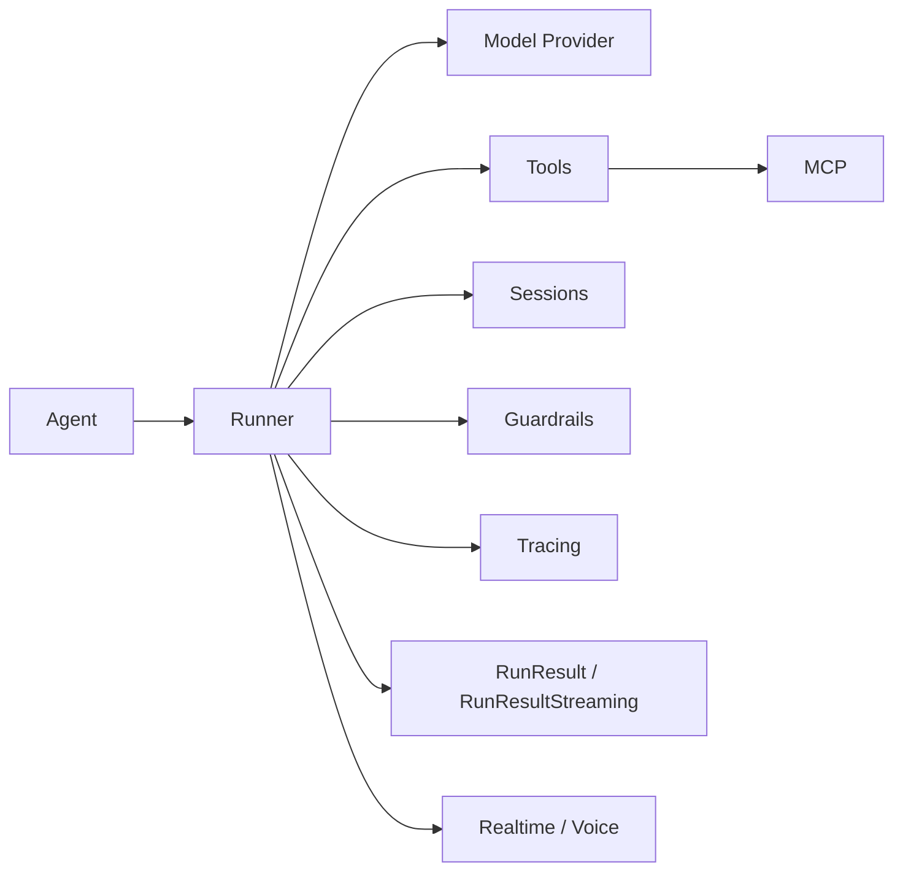

# openai-agents-rust docs

This is the product docs home for the Rust agents runtime. Start here if you want to build with the library, understand the runtime model, or find the right subsystem to extend.

## Start With A Working Path

| Goal | Read this first | Then read |
| --- | --- | --- |
| build a first agent | [quickstart.md](quickstart.md) | [agents.md](agents.md), [running_agents.md](running_agents.md) |
| run with tools | [tools.md](tools.md) | [guardrails.md](guardrails.md), [human_in_the_loop.md](human_in_the_loop.md) |
| keep conversational state | [sessions/README.md](sessions/README.md) | [results.md](results.md), [context.md](context.md) |
| stream events live | [streaming.md](streaming.md) | [tracing.md](tracing.md), [usage.md](usage.md) |
| work with MCP | [mcp.md](mcp.md) | [tools.md](tools.md), [human_in_the_loop.md](human_in_the_loop.md) |
| build realtime flows | [realtime/README.md](realtime/README.md) | [realtime/events.md](realtime/events.md), [realtime/audio.md](realtime/audio.md) |
| build voice workflows | [voice/README.md](voice/README.md) | [voice/workflow.md](voice/workflow.md), [voice/pipeline.md](voice/pipeline.md) |
| find the public API | [ref/README.md](ref/README.md) | [examples.md](examples.md) |

## What The Runtime Looks Like

## Read By Topic

- [quickstart.md](quickstart.md): install the crate and ship your first run
- [agents.md](agents.md): define agents, output schemas, tools, and handoffs
- [running_agents.md](running_agents.md): choose between `run`, `run_sync`, `Runner`, and streamed execution
- [config.md](config.md): understand `RunConfig`, `RunOptions`, precedence, and runtime knobs
- [context.md](context.md): thread application state through runs, tools, and hooks
- [multi_agent.md](multi_agent.md): compose routers, specialists, and nested agent tools
- [tools.md](tools.md): add function tools, shell/computer tools, hosted tools, and approvals
- [guardrails.md](guardrails.md): stop bad inputs, outputs, and tool traffic before it leaks
- [handoffs.md](handoffs.md): route between agents with explicit history control
- [human_in_the_loop.md](human_in_the_loop.md): approvals, interruptions, and operator review
- [mcp.md](mcp.md): attach MCP servers, tools, resources, and filtering
- [streaming.md](streaming.md): consume `StreamEvent` values as a run happens
- [results.md](results.md): replay, normalize, and continue runs
- [usage.md](usage.md): reason about usage, turns, and operational cost
- [tracing.md](tracing.md): instrument runs with traces, spans, and processors
- [visualization.md](visualization.md): generate graphs and visual artifacts from agent systems
- [repl.md](repl.md): drive the runtime interactively
- [examples.md](examples.md): find runnable programs by goal
- [release.md](release.md): release and docs maintenance workflow

## Subsystem Guides

- [models/README.md](models/README.md)
- [sessions/README.md](sessions/README.md)
- [realtime/README.md](realtime/README.md)
- [voice/README.md](voice/README.md)
- [ref/README.md](ref/README.md)

## What To Expect From These Docs

Every page is written to answer four questions quickly:

1. what the feature is for
2. what the smallest working example looks like
3. which types and entrypoints actually matter
4. what to read next

If you find duplicate explanations for the same feature, that is a bug in the docs.
