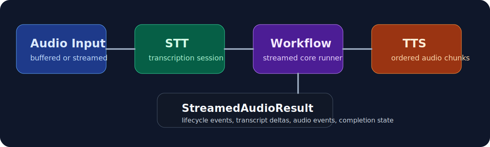

# Realtime Audio

Use this page when your realtime flow includes audio input, audio output, or playback state tracking.

## What The Runtime Covers

- audio format normalization
- playback tracking
- input and output audio settings
- transport-backed audio message handling

## Practical Guidance

- normalize formats at the edges
- keep playback tracking in the session, not in scattered UI code
- use the runtime audio config types instead of inventing custom ad-hoc payload objects

## Read Next

- [transports.md](transports.md)
- [../voice/README.md](../voice/README.md)
